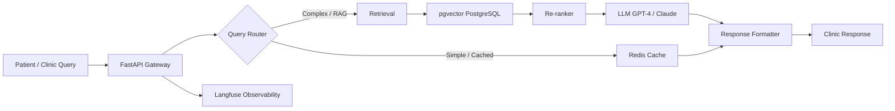

```markdown
## Faraz Mubeen Haider

**AI Engineer** — Production RAG Systems · LLM Orchestration · Scalable Python Backends

I build AI systems that solve real business problems, not demos. Currently designing RAG pipelines and AI agent workflows at ClinicOps AI (Doha), serving GCC outpatient clinics. Previously shipped an AI automation SaaS MVP in 6 weeks at 1337 Ventures (KL).

**Remote-first engineer based in Pakistan.** Available 6 PM – 2 AM PKT for US timezone overlap (9 AM – 5 PM EST).

📫 faraz.outreach8@gmail.com · [LinkedIn](https://www.linkedin.com/in/fm618) · [Portfolio](https://faraz-mubeen.vercel.app/)

---

## 🏭 Production Systems

### clinicops-rag-platform *(Private — architecture shared below)*
Multi-tenant RAG system for healthcare appointment automation built for GCC outpatient clinics.

**Design goals:**
- Low-latency retrieval for real-time patient queries
- Cost-efficient model routing across query complexity tiers
- Observable LLM pipeline with traceable retrieval and generation

**Stack:** Python · FastAPI · LangChain · pgvector · PostgreSQL · Redis · Docker · AWS EC2 · Langfuse

**Architecture:**



**Key design decisions:**
- **pgvector over separate vector DB:** Reduced infrastructure complexity by keeping embeddings inside PostgreSQL alongside relational clinic data
- **Query router with cache tier:** Simple scheduling questions hit Redis; complex medical history queries trigger full RAG
- **Langfuse tracing:** Every retrieval and generation step is logged for debugging and cost analysis

---

## 🚀 Featured Projects

### [SerisAI](https://github.com/Faraz6180/serisai) — Real-Time Fraud Detection API
Production-ready ML fraud detection API designed for high-volume transaction scoring with sub-100ms inference latency.

- Multi-agent LLM orchestration for anomaly pattern detection
- FastAPI backend with Pydantic validation and structured logging
- AWS Lambda deployment with horizontal scaling design
- **Stack:** Python · FastAPI · PostgreSQL · OpenAI API · AWS Lambda

### [DevAI](https://github.com/Faraz6180/devai) — AI Debugging Assistant
Context-aware code analysis tool using multi-agent LLM orchestration to suggest automatic fixes.

- **Recognition:** DeepSeek Hackathon Finalist
- Parses error traces and suggests fixes via VS Code API integration
- Automated test case generation for validation
- **Stack:** LangChain · OpenAI · FastAPI · VS Code API

### [Aptimi](https://github.com/Faraz6180/aptimi) — AI Research Assistant
Semantic search system over academic literature with citation-grounded answer generation.

- **Recognition:** Replit x Cursor Hackathon Finalist
- Sub-second retrieval via FAISS vector indexing with intelligent document chunking
- Citation-grounded LLM synthesis to reduce hallucination
- **Stack:** Python · LangChain · FAISS · Streamlit

### [CodeBase RAG](https://github.com/Faraz6180/codebase-rag) — Natural-Language Code Query
RAG system enabling natural-language queries over codebases.

- Vector-indexed repository chunks for semantic retrieval
- Modular architecture for multi-repository ingestion and incremental indexing
- **Stack:** Python · LangChain · FAISS · FastAPI

---

## 🏆 Hackathons & Competitions

| Competition | Result | Project |
|-------------|--------|---------|
| IBM Granite Hackathon | **Winner** | AI automation system |
| Qubic Hack the Future | **Winner** | Production AI prototype |
| RAISE YOUR HACK | **Winner** | RAG-based assistant |
| DeepSeek Hackathon | **Finalist** | DevAI debugging tool |
| Replit x Cursor Hackathon | **Finalist** | Aptimi research assistant |
| Harvard CS50x Puzzle Day 2025 | **Perfect 9/9** (Top 1%) | — |
| UC Berkeley CALICO | **Top 12%** (96th / 820 teams) | — |

**LabLab.ai Global Rank:** Top 100 (#83) · 17+ hackathons · [Profile](https://lablab.ai/u/@Faraz_Mubeen)

---

## ✍️ Technical Writing

115+ articles on AI engineering, RAG systems, LLM deployment, and production backend design.

→ [Read all articles on Medium](https://medium.com/@Faraz6180)

---

## 🛠️ Tech Stack

**Languages:** Python · TypeScript · JavaScript · SQL

**Backend:** FastAPI · Flask · Pydantic · AsyncIO · Node.js · Express

**AI / ML:** LangChain · LlamaIndex · OpenAI API · RAG · PyTorch · Scikit-Learn · FAISS · Pinecone · pgvector · CrewAI · AutoGen · LangGraph

**Databases:** PostgreSQL · Redis

**Cloud / DevOps:** AWS (EC2, S3, Lambda, IAM) · Docker · GitHub Actions · Git · Linux

**Frontend:** React.js · Next.js · Streamlit

---

## 📚 Currently Learning

- Distributed systems design for AI services at scale
- Advanced RAG evaluation methodologies (RAGAS, custom metrics)
- Production monitoring and observability for LLM applications
- Cost optimization strategies for multi-tenant LLM workloads

---

## 📈 GitHub Stats

<p align="left">
  
  
</p>

---

*Remote-first · PKT (UTC+5) · Available for US timezone overlap · Open to AI Engineering and Python Backend roles*
```
